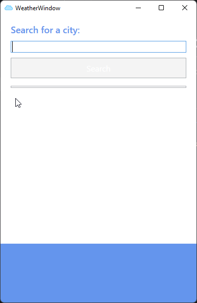
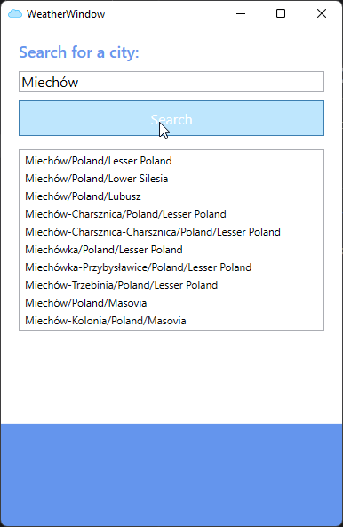
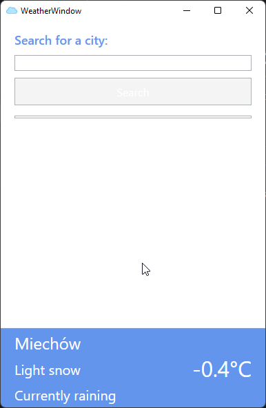

# Weather App

Weather app is application written in WPF when I was on the beginning of my journey with .NET

## About

I wrote this application while watching the WPF course from Udemy.

The app allows you to search for any city in the world and see the weather.

